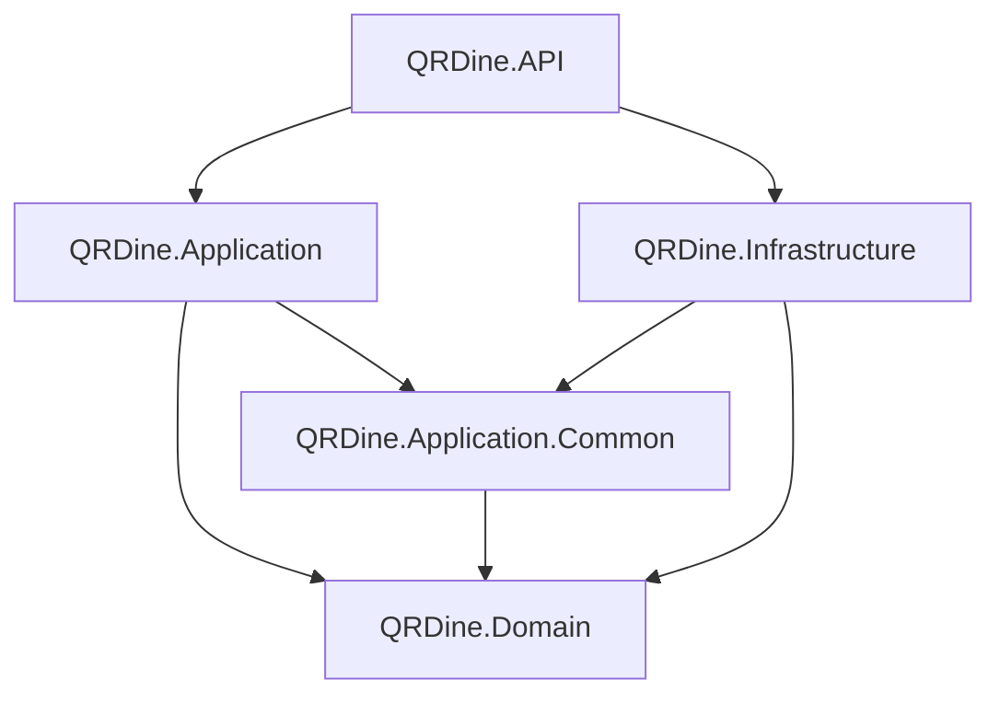

# QR Dine App


**QR Dine API** is a modern **multi-tenant SaaS backend** built to power QR-based digital menu systems for restaurants, cafés, and retail stores.

The system allows multiple businesses to register, manage their profiles, and generate unique QR codes that link to fully customizable online menus. Each store operates independently within a secure multi-tenant architecture, ensuring data isolation and scalability.

---

## Architecture

Built with **.NET 8 Web API** using **Clean Architecture** (Onion Architecture) and **CQRS** (Command Query Responsibility Segregation).

| Project                     | Layer               | Responsibility                                            |
| --------------------------- | ------------------- | --------------------------------------------------------- |
| `QRDine.API`                | Presentation        | RESTful endpoints, Swagger, middleware, DI orchestration  |
| `QRDine.Application`        | Application         | CQRS handlers (MediatR), DTOs, validators, specifications |
| `QRDine.Application.Common` | Shared Abstractions | Interfaces, pipeline behaviors, custom exceptions         |
| `QRDine.Domain`             | Domain              | Entities, enums, value objects, business rules            |
| `QRDine.Infrastructure`     | Infrastructure      | EF Core, ASP.NET Identity, JWT, Cloudinary, repositories  |



---

## Tech Stack

| Category       | Technology                           |
| -------------- | ------------------------------------ |
| Runtime        | .NET 8                               |
| ORM            | Entity Framework Core 8 (SQL Server) |
| CQRS           | MediatR                              |
| Validation     | FluentValidation                     |
| Mapping        | AutoMapper                           |
| Specifications | Ardalis.Specification                |
| Authentication | ASP.NET Core Identity + JWT Bearer   |
| File Upload    | Cloudinary                           |
| API Docs       | Swagger (Swashbuckle)                |
| API Versioning | Asp.Versioning.Mvc                   |

---

## Domain Modules

| Module       | Entities                                        | Status            | Tests | Documentation                              |
| ------------ | ----------------------------------------------- | ----------------- | ----- | ------------------------------------------ |
| **Catalog**  | Category, Product, Table, ToppingGroup, Topping | ✅ Complete       | ✅ 12 | [Catalog Module](docs/features/catalog/)   |
| **Identity** | ApplicationUser, ApplicationRole, RefreshToken  | ✅ Complete       | 🔄    | [Identity Module](docs/features/identity/) |
| **Tenant**   | Merchant                                        | ✅ Complete       | 🔄    | [Tenant Module](docs/features/tenant/)     |
| **Sales**    | Order, OrderItem                                | 🟡 In Development | ✅ 6  | [Sales Module](docs/features/sales/)       |
| **Billing**  | Plan, Subscription, FeatureLimit, Transaction   | ✅ Complete       | ✅ 5  | [Billing Module](docs/features/billing/)   |
| **Staffs**   | ApplicationUser (Staff role)                    | ✅ Complete       | 🔄    | [Staffs Module](docs/features/staffs/)     |

**Test Status:** ✅ Complete | 🔄 Planned | 🟡 In Progress
**Total: 36+ unit tests** covering command handlers and service layers

## API Groups

| Group          | Route                    | Auth                        | Purpose                        |
| -------------- | ------------------------ | --------------------------- | ------------------------------ |
| **Management** | `/api/v1/management/...` | JWT (Merchant)              | Store management CRUD          |
| **Storefront** | `/api/v1/storefront/...` | Public                      | Customer-facing read endpoints |
| **Auth**       | `/api/v1/auth/...`       | Public                      | Login                          |
| **Users**      | `/api/v1/users/...`      | JWT (SuperAdmin / Merchant) | User registration              |

---

## Multi-Tenancy

Data isolation is enforced at three levels:

1. **Global Query Filters** — EF Core automatically filters all tenant-scoped entities by `MerchantId`
2. **Auto MerchantId Stamp** — `SaveChangesAsync` automatically sets `MerchantId` on new entities implementing `IMustHaveMerchant`
3. **Handler Ownership Checks** — Explicit verification in update/delete handlers

---

## Getting Started

### Prerequisites

- [.NET 8 SDK](https://dotnet.microsoft.com/download/dotnet/8.0)
- [SQL Server](https://www.microsoft.com/en-us/sql-server/) (LocalDB, Express, or full)
- [Cloudinary account](https://cloudinary.com/) (for image uploads)

### Setup

1. **Clone the repository:**

   ```bash
   git clone https://github.com/mduy26100/qr-dine-app.git
   cd qr-dine-app
   ```

2. **Configure `appsettings.json`** (`src/QRDine.API/appsettings.template.json`):

   ```json
   {
     "ConnectionStrings": {
       "DefaultConnection": "Server=YOUR_SERVER;Database=QRDine;Trusted_Connection=True;TrustServerCertificate=True;"
     },
     "Jwt": {
       "Secret": "<your-256-bit-secret>",
       "ValidIssuer": "http://localhost:xxxx",
       "ValidAudience": "http://localhost:xxxx",
       "AccessTokenExpiryMinutes": 15,
       "RefreshTokenExpiryDays": 7
     },
     "Cloudinary": {
       "CloudName": "<your-cloud-name>",
       "ApiKey": "<your-api-key>",
       "ApiSecret": "<your-api-secret>"
     }
   }
   ```

3. **Apply database migrations:**

   ```bash
   dotnet ef database update --project src/QRDine.Infrastructure --startup-project src/QRDine.API
   ```

4. **Run the application:**

   ```bash
   dotnet run --project src/QRDine.API
   ```

5. **Access Swagger UI:** `https://localhost:xxxx/swagger`

### Seeded Data

On first run, the system automatically seeds:

- **Roles:** SuperAdmin, Merchant, Staff, Guest
- **SuperAdmin account:** `admin@qrdine.com` / `Admin@123!`

---

## 🎯 Quick Navigation

| Need                             | Link                                                      |
| -------------------------------- | --------------------------------------------------------- |
| **First time setup?**            | [👉 Getting Started](docs/development/getting-started.md) |
| **Writing unit tests?**          | [👉 Unit Testing Guide](docs/development/testing/)        |
| **Understanding the codebase?**  | [👉 Architecture Overview](docs/architecture/)            |
| **Looking for an API endpoint?** | [👉 API Reference](docs/api/)                             |
| **Working on a feature?**        | [👉 Development Guidelines](docs/development/)            |
| **Deploying to production?**     | [👉 Docker & Deployment](docs/docker/)                    |
| **Having issues?**               | [👉 Troubleshooting](docs/troubleshooting.md)             |
| **Multi-tenancy questions?**     | [👉 Database & Multi-Tenancy](docs/database/)             |
| **Security concerns?**           | [👉 Security Overview](docs/security/)                    |

---

## Documentation

Complete technical documentation is organized in the [`docs/`](docs/) directory with dedicated sections for each topic:

### 📖 Documentation Sections

**Getting Started & Basics**

- [📘 Complete Documentation Home](docs/README.md) — Entry point for all documentation
- [🚀 Getting Started Guide](docs/development/getting-started.md) — 5-step local setup guide
- [📁 Project Structure](docs/architecture/project-structure.md) — Folder organization and file structure

**Architecture & Design**

- [🏗️ Architecture Overview](docs/architecture/) — Clean Architecture, CQRS, design patterns
- [🗄️ Database & Multi-Tenancy](docs/database/) — Schema, isolation strategy, migrations
- [🔒 Security Overview](docs/security/) — Authentication, authorization, data protection

**Development**

- [💻 Development Guidelines](docs/development/) — CQRS patterns, coding standards
- [🧪 Unit Testing Guide](docs/development/testing/) — Test infrastructure, patterns, 36+ passing tests
- [⚙️ Configuration Guide](docs/configuration/) — Environment setup, secrets management
- [🔌 API Reference](docs/api/) — Endpoints, response formats, authentication

**Deployment & Operations**

- [📦 Build & Deployment](docs/deployment/) — Azure, Docker, CI/CD, migrations
- [🐳 Docker & Deployment](docs/docker/) — Production Docker setup, orchestration, deployment commands
- [🔧 External Services](docs/external-services/) — Cloudinary, third-party integrations
- [❓ Troubleshooting](docs/deployment/troubleshooting.md) — Common issues and solutions

### 🎯 Feature Modules

Each feature module is fully documented with use cases and implementation details:

- [📦 Catalog Module](docs/features/catalog/) — Menu, products, tables, customizations
- [🔐 Identity Module](docs/features/identity/) — Authentication, registration, roles
- [📋 Sales Module](docs/features/sales/) — Orders, real-time tracking, status management
- [💳 Billing Module](docs/features/billing/) — Subscription plans, feature limits
- [🏢 Tenant Module](docs/features/tenant/) — Multi-tenancy, merchant isolation
- [👥 Staffs Module](docs/features/staffs/) — Staff management, permissions, performance

**Quick reference:** [Features Overview](docs/features/) for all modules

---

## Project Structure

```
qr-dine-app/
├── src/
│   ├── QRDine.API/
│   │   ├── Controllers/
│   │   │   ├── Identity/          # Auth, Users
│   │   │   ├── Management/       # Catalog CRUD (Merchant)
│   │   │   └── Storefront/       # Public endpoints
│   │   ├── DependencyInjection/   # Modular DI registration
│   │   ├── Filters/               # ApiResponseFilter
│   │   ├── Middlewares/           # ExceptionHandlingMiddleware
│   │   ├── Responses/            # ApiResponse, ApiError, Meta
│   │   └── Requests/             # Form-data models
│   ├── QRDine.Application/
│   │   └── Features/
│   │       ├── Catalog/           # Categories & Products CQRS
│   │       └── Identity/          # Login & Registration CQRS
│   ├── QRDine.Application.Common/
│   │   ├── Abstractions/          # Interfaces
│   │   ├── Behaviors/             # ValidationBehavior
│   │   └── Exceptions/            # Custom exceptions
│   ├── QRDine.Domain/
│   │   ├── Catalog/               # Category, Product, Table, Topping entities
│   │   ├── Sales/                 # Order, OrderItem entities
│   │   ├── Tenant/                # Merchant entity
│   │   ├── Common/                # BaseEntity, IMustHaveMerchant
│   │   └── Enums/                 # OrderStatus
│   └── QRDine.Infrastructure/
│       ├── Catalog/               # Feature repositories
│       ├── ExternalServices/      # Cloudinary
│       ├── Identity/              # ASP.NET Identity, JWT
│       └── Persistence/           # DbContext, EF configs, migrations, seeding
├── tests/
│   └── QRDine.Application.Tests/  # 36+ unit tests (xUnit, Moq, FluentAssertions)
│       ├── Features/              # Test files organized by module
│       │   ├── Catalog/           # 12 Catalog tests
│       │   ├── Sales/             # 6 Sales tests
│       │   └── Billing/           # 5 Billing tests
│       └── Common/                # Builders, Mocks, Fixtures
├── docs/                          # Technical documentation
└── QRDine.sln
```

---

## Author

**Do Manh Duy (Mark)**  
Full-stack Developer (.NET & React)

- 📧 Email: manhduy261000@gmail.com
- 🐙 GitHub: [github.com/mduy26100](https://github.com/mduy26100)
- 💼 LinkedIn: [linkedin.com/in/duy-do-manh-1a44b42a4](https://www.linkedin.com/in/duy-do-manh-1a44b42a4/)
- 📘 Facebook: [facebook.com/zuynuxi](https://www.facebook.com/zuynuxi/)

---

## License

This project is licensed under the MIT License — feel free to use, modify, and distribute it in accordance with the license terms.

---

<div align="center">

**⭐ If you find this project helpful, please give it a star! ⭐**

</div>
