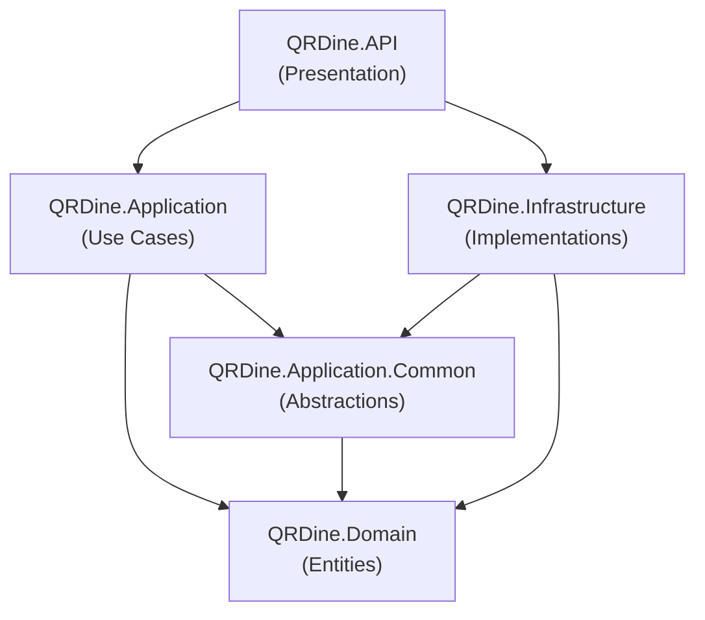

# Architecture Overview

QRDine is built using **Clean Architecture** (also known as Onion Architecture) targeting **.NET 8**. The system is a multi-tenant SaaS backend for QR-based digital menu management.

---

## Solution Structure

```
qr-dine-app/
├── src/
│   ├── QRDine.API/                  # Presentation Layer
│   ├── QRDine.Application/          # Application Layer (CQRS)
│   ├── QRDine.Application.Common/   # Shared Abstractions
│   ├── QRDine.Domain/               # Domain Layer
│   └── QRDine.Infrastructure/       # Infrastructure Layer
├── docs/                            # Documentation
└── QRDine.sln                       # Solution file
```

---

## Layer Responsibilities

### Domain Layer (`QRDine.Domain`)

The innermost layer containing core business entities with zero external dependencies. Organized into three domain modules:

| Module | Entities | Description |
|--------|----------|-------------|
| **Catalog** | `Category`, `Product`, `Table`, `Topping`, `ToppingGroup`, `ProductToppingGroup` | Menu structure and restaurant table management |
| **Sales** | `Order`, `OrderItem` | Order lifecycle tracking |
| **Tenant** | `Merchant` | Tenant identity and configuration |

**Key abstractions:**

- **`BaseEntity<TId>`** — Generic base class providing `Id`, `CreatedAt`, `UpdatedAt`, and `IsDeleted` (soft-delete flag). The non-generic `BaseEntity` defaults `TId` to `Guid`.
- **`IMustHaveMerchant`** — Marker interface enforcing `MerchantId` on all tenant-scoped entities. Used by `ApplicationDbContext` to auto-stamp `MerchantId` on new entities.

```csharp
// src/QRDine.Domain/Common/BaseEntity.cs
public abstract class BaseEntity<TId>
{
    public TId Id { get; set; } = default!;
    public DateTime CreatedAt { get; set; } = DateTime.UtcNow;
    public DateTime? UpdatedAt { get; set; }
    public bool IsDeleted { get; set; } = false;
}
```

### Application Layer (`QRDine.Application`)

Implements business use cases using **CQRS** (Command Query Responsibility Segregation) via **MediatR**. Each feature is self-contained with its own Commands, Queries, Handlers, DTOs, Validators, and Specifications.

**Feature structure:**

```
Features/
├── Catalog/
│   ├── Categories/
│   │   ├── Commands/
│   │   │   ├── CreateCategory/
│   │   │   ├── UpdateCategory/
│   │   │   └── DeleteCategory/
│   │   ├── Queries/
│   │   │   ├── GetCategoriesByMerchant/
│   │   │   └── GetMyCategories/
│   │   ├── DTOs/
│   │   ├── Extensions/
│   │   └── Specifications/
│   ├── Products/
│   │   ├── Commands/CreateProduct/
│   │   ├── DTOs/
│   │   └── Specifications/
│   ├── Mappings/
│   └── Repositories/
└── Identity/
    ├── Commands/
    │   ├── Login/
    │   ├── RegisterMerchant/
    │   └── RegisterStaff/
    ├── DTOs/
    └── Services/
```

**Key patterns:**

- **Commands** modify state → return DTOs
- **Queries** read state → return DTOs or lists
- **Handlers** orchestrate business logic with validation and transactional integrity
- **Specifications** encapsulate query predicates using the [Ardalis.Specification](https://github.com/ardalis/Specification) library

### Application.Common (`QRDine.Application.Common`)

Shared abstractions and cross-cutting concerns decoupled from feature implementations.

| Component | Purpose |
|-----------|---------|
| `IRepository<T>` | Generic repository interface extending `IRepositoryBase<T>` from Ardalis.Specification |
| `IApplicationDbContext` | Database context abstraction exposing `BeginTransactionAsync` |
| `IDatabaseTransaction` | Transaction abstraction for commit/rollback |
| `ICurrentUserService` | Current user context (UserId, Roles, MerchantId, IsAuthenticated) |
| `IFileUploadService` | File upload abstraction with `FileUploadRequest` |
| `ValidationBehavior<TRequest, TResponse>` | MediatR pipeline behavior for automatic FluentValidation |

**Custom exception hierarchy:**

| Exception | HTTP Status | Error Type |
|-----------|------------|------------|
| `ValidationException` | 400 | `validation-error` |
| `BusinessRuleException` | 400 | `business-rule-violation` |
| `NotFoundException` | 404 | `not-found` |
| `ConflictException` | 409 | `conflict` |
| `ConcurrencyException` | 409 | `concurrency-error` |
| `ForbiddenException` | 403 | `forbidden` |
| `ApplicationExceptionBase` | 400 | `application-error` |

### Infrastructure Layer (`QRDine.Infrastructure`)

Implements all external concerns: persistence, identity, and third-party integrations.

| Module | Key Classes | Responsibility |
|--------|-------------|----------------|
| **Persistence** | `ApplicationDbContext`, `Repository<T>`, EF Configurations, Migrations | EF Core with SQL Server, multi-tenant query filters |
| **Identity** | `LoginService`, `RegisterService`, `JwtTokenGenerator`, `CurrentUserService` | ASP.NET Core Identity + JWT authentication |
| **ExternalServices** | `CloudinaryFileUploadService` | Image upload to Cloudinary |
| **Catalog** | `CategoryRepository`, `ProductRepository` | Feature-specific repository extensions |

### API Layer (`QRDine.API`)

The outermost layer handling HTTP concerns, dependency injection, and middleware.

**Key components:**

- **Controllers** — Thin controllers dispatching commands/queries via MediatR
- **DI Registration** — Modular service registration split by architectural layer (see below)
- **Middleware** — Global exception handling with structured error responses
- **Filters** — `ApiResponseFilter` wraps all responses in a unified `ApiResponse` envelope
- **Swagger** — Split into `management` and `storefront` API groups

**DI Registration Order** (defined in `src/QRDine.API/DependencyInjection/ServiceCollectionExtensions.cs`):

```
1. AddInfrastructure     → Persistence + External Services
2. AddSecurity           → Identity + JWT Authentication
3. AddCrossCutting       → API Versioning
4. AddApplication        → MediatR + AutoMapper
5. AddFeatures           → Feature-specific repositories
```

---

## Dependency Flow



> The Domain layer has **zero dependencies**. Application depends on Domain and Common. Infrastructure implements Common abstractions but never references Application directly (except for feature-specific service interfaces like `ILoginService`).

---

## Technology Stack

| Category | Technology |
|----------|-----------|
| Runtime | .NET 8 |
| ORM | Entity Framework Core 8 (SQL Server) |
| CQRS | MediatR |
| Validation | FluentValidation |
| Mapping | AutoMapper |
| Specifications | Ardalis.Specification |
| Authentication | ASP.NET Core Identity + JWT Bearer |
| File Upload | Cloudinary (via CloudinaryDotNet SDK) |
| API Docs | Swashbuckle (Swagger) |
| API Versioning | Asp.Versioning.Mvc |

---

## Startup Pipeline

Defined in `src/QRDine.API/Program.cs`:

1. Register controllers with `ApiResponseFilter`
2. Configure Swagger with two API groups (`management`, `storefront`)
3. Register all application services via `AddApplicationServices()`
4. Build the application
5. Enable Swagger UI (Development only)
6. Enable HTTPS redirection
7. Register `ExceptionHandlingMiddleware`
8. Enable Authentication → Authorization
9. Map controllers
10. Seed identity data (roles + SuperAdmin user) via `IdentitySeeder`
