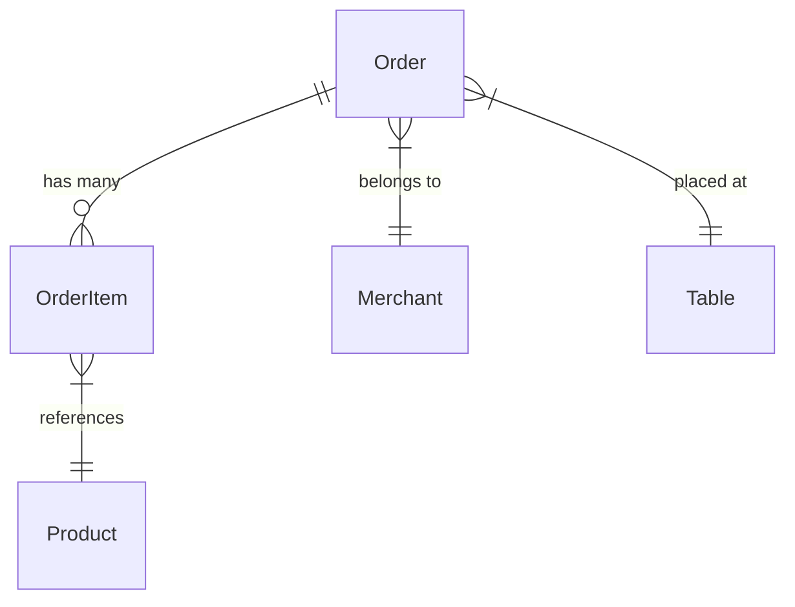

# Sales Module

The Sales module manages the order lifecycle, covering order creation, item tracking, and status management.

> **Note:** This module currently defines the domain entities and EF Core configurations. No CQRS commands, queries, or API endpoints have been implemented yet.

---

## Domain Entities

### Order

**File:** `src/QRDine.Domain/Sales/Order.cs`

Represents a customer order placed at a specific table.

| Property | Type | Description |
|----------|------|-------------|
| `Id` | `Guid` | Inherited from `BaseEntity` |
| `MerchantId` | `Guid` | Tenant scope (via `IMustHaveMerchant`) |
| `TableId` | `Guid` | The table where the order was placed |
| `SessionId` | `Guid` | Session identifier for the ordering session |
| `Status` | `OrderStatus` | Current order lifecycle status (default: `Pending`) |
| `TotalAmount` | `decimal` | Order total |
| `Note` | `string?` | Customer notes |

**Navigation properties:** `Merchant`, `Table`, `OrderItems`

### OrderItem

**File:** `src/QRDine.Domain/Sales/OrderItem.cs`

Represents a single line item within an order.

| Property | Type | Description |
|----------|------|-------------|
| `Id` | `Guid` | Inherited from `BaseEntity` |
| `OrderId` | `Guid` | Parent order reference |
| `ProductId` | `Guid` | Reference to the ordered product |
| `ProductName` | `string` | Snapshot of product name at time of order |
| `UnitPrice` | `decimal` | Price per unit at time of order |
| `Quantity` | `int` | Number of items |
| `Note` | `string?` | Item-specific notes |

**Navigation properties:** `Product`, `Order`

> The `ProductName` and `UnitPrice` fields are snapshotted at order creation time, ensuring the order history remains accurate even if the product is later modified or deleted.

---

## Order Status Enum

**File:** `src/QRDine.Domain/Enums/OrderStatus.cs`

```csharp
public enum OrderStatus
{
    Pending = 1,
    Cooking = 2,
    Served = 3,
    Paid = 4,
    Cancelled = 5
}
```

| Status | Value | Description |
|--------|-------|-------------|
| `Pending` | 1 | Order placed, awaiting kitchen acknowledgment |
| `Cooking` | 2 | Order is being prepared |
| `Served` | 3 | Order has been delivered to the table |
| `Paid` | 4 | Payment completed |
| `Cancelled` | 5 | Order was cancelled |

---

## EF Core Configuration

- **`OrderConfiguration`** — `src/QRDine.Infrastructure/Persistence/Configurations/Sales/OrderConfiguration.cs`
- **`OrderItemConfiguration`** — `src/QRDine.Infrastructure/Persistence/Configurations/Sales/OrderItemConfiguration.cs`

Both are in the `sales` schema and are configured in `ApplicationDbContext.OnModelCreating`.

The `Order` entity has a **global query filter** for multi-tenancy:

```csharp
builder.Entity<Order>().HasQueryFilter(e => !CurrentMerchantId.HasValue || e.MerchantId == CurrentMerchantId);
```

---

## Entity Relationships



---

## Current Implementation Status

| Component | Status |
|-----------|--------|
| Domain Entities | ✅ Implemented |
| EF Core Configurations | ✅ Implemented |
| Database Migration | ✅ `AddSalesSchema` migration applied |
| Global Query Filter | ✅ Applied on `Order` |
| CQRS Commands/Queries | ❌ Not yet implemented |
| API Endpoints | ❌ Not yet implemented |
| Order Status Transitions | ❌ Not yet implemented |
